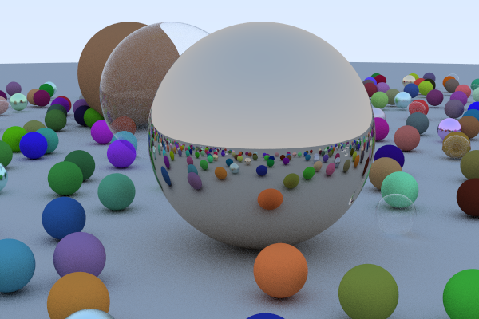

# Path Tracer



A [Rust](https://www.rust-lang.org) implementation of [Ray Tracing in One Weekend](https://in1weekend.blogspot.com/2016/01/ray-tracing-in-one-weekend.html), mainly for learning purpose.

## Execution
Make sure you have `Rust` with version > 1.27 installed and `cargo` in your `PATH`, then run
```
cargo run --release
```
